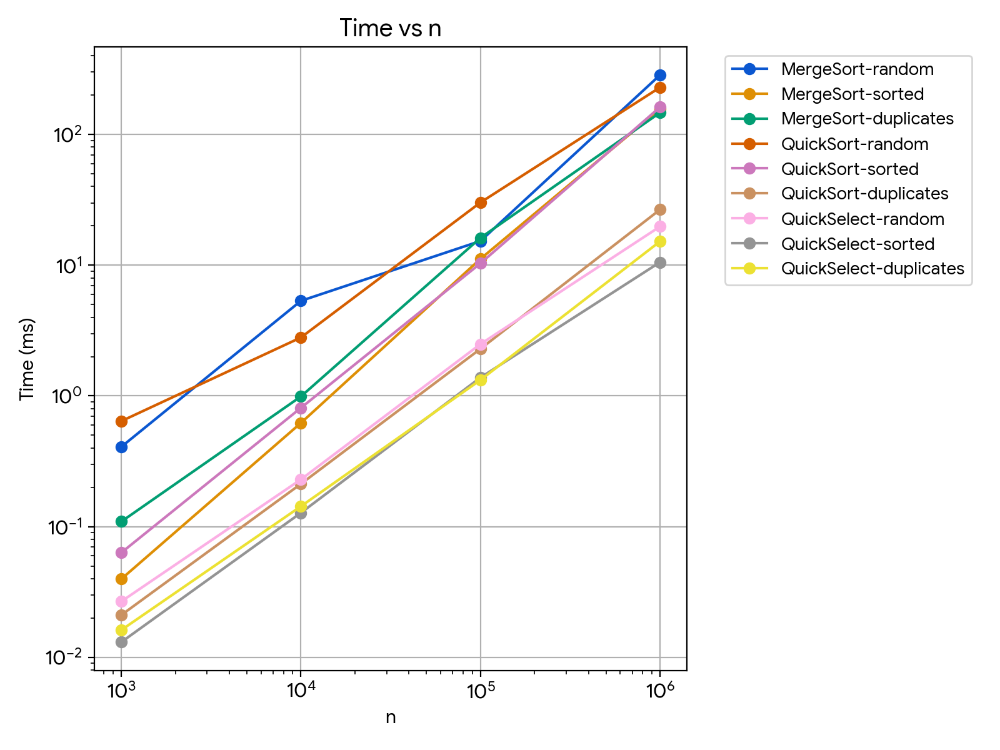
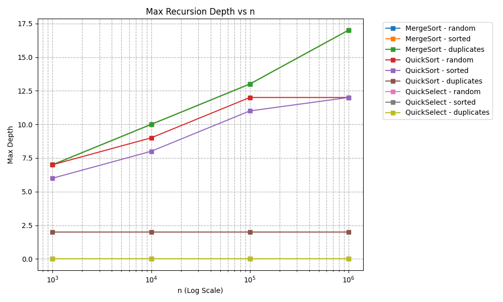
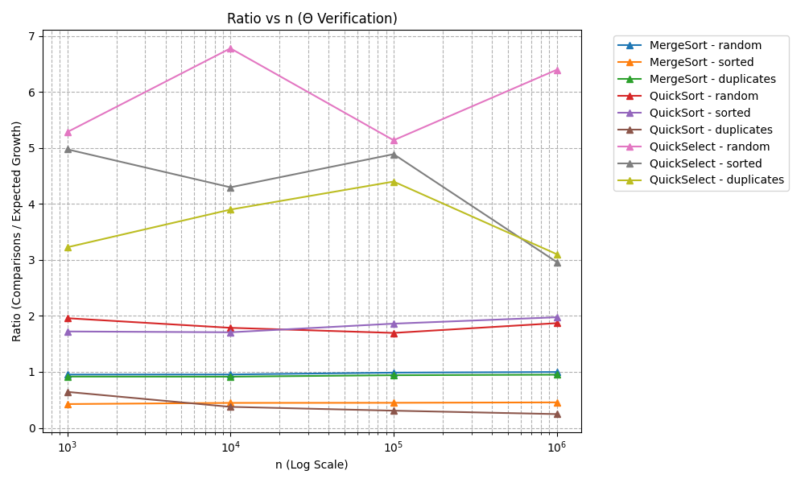

# Assignment 1: Report - Divide and Conquer & Asymptotic Analysis

## 1. Introduction
This report presents the implementation and empirical evaluation of sorting and selection algorithms: **Merge Sort**, **Quick Sort**, and **Quick Select**, developed in Java 17 as part of the Design and Analysis of Algorithms course.

## 2. Algorithmic Optimizations
* **Merge Sort**: Implemented with a reusable auxiliary buffer array to minimize allocation overhead and an Insertion Sort cutoff for small subarrays ($n \le 15$).
* **Quick Sort**: Features a random pivot selection to avoid worst-case scenarios on sorted inputs, 3-way partitioning (Dutch National Flag) to handle duplicate elements efficiently, and smaller-side first recursive calls to strictly bound the recursion depth to $O(\log n)$.
* **Quick Select**: Leverages the shared 3-way partition logic to find the $k$-th smallest element in expected $O(n)$ time.

## 3. Asymptotic Analysis & Master Theorem
* **Merge Sort**: Recurrence relation $T(n) = 2T(n/2) + \Theta(n)$. By Case 2 of the Master Theorem ($a = 2, b = 2, f(n) = \Theta(n)$), the time complexity is $O(n \log n)$ across all cases (worst, average, best).
* **Quick Sort**: Average and best-case time complexity is $O(n \log n)$. Due to random pivot selection and 3-way partitioning, degenerate cases are avoided, and recursion depth is bounded to $O(\log n)$.
* **Quick Select**: Expected time complexity is $O(n)$, while the worst-case is $O(n^2)$ (minimized via random pivoting).

## 4. Benchmark Results Summary
Based on the execution data generated in `results.csv`:
* **Merge Sort** demonstrates highly predictable execution times and stable comparison counts regardless of initial data patterns (random, sorted, or duplicates).
* **Quick Sort** shows exceptional performance on arrays with high duplication due to 3-way partitioning grouping equal elements efficiently.

## 5. Asymptotic Bounds Summary

| Algorithm | Best Case | Average Case | Worst Case | Reason / Notes |
| :--- | :--- | :--- | :--- | :--- |
| **Insertion Sort** | $\Omega(n)$ | $\Theta(n^2)$ | $O(n^2)$ | Linear on already sorted array; quadratic on random/reverse data. |
| **Merge Sort** | $\Theta(n \log n)$ | $\Theta(n \log n)$ | $\Theta(n \log n)$ | Divide-and-conquer with guaranteed balanced splits and linear merge. |
| **Quick Sort** | $\Omega(n \log n)$ | $\Theta(n \log n)$ | $O(n^2)$ | Randomized pivot and 3-way partition prevent $O(n^2)$ on sorted/duplicate inputs. |
| **Quick Select** | $\Omega(n)$ | $\Theta(n)$ | $O(n^2)$ | Expected linear time via single-side partitioning; worst case mitigated by random pivot. |

## 6. Performance Plots

### Time vs n

### Max Recursion Depth vs n

### Ratio vs n ($\Theta$ Verification)

## 7. Discussion & Empirical Analysis
The empirical measurements closely match theoretical expectations. For Merge Sort and Quick Sort, the ratio plots ($\text{Comparisons} / (n \log n))$ stabilize into horizontal lines as $n$ grows, confirming $\Theta(n \log n)$ behavior. Minor fluctuations at smaller $n$ ($1,000$) are attributed to JVM warm-up effects, Just-In-Time (JIT) compilation, and garbage collection overhead. 

For Quick Sort, the 3-way partition successfully handles arrays with heavy duplicate values, keeping recursion depth remarkably low (bounded to $O(\log n)$), while Quick Select operates iteratively without recursion stack overhead (depth = 0). Overall, the optimizations (reusable buffer, insertion sort cutoff, randomized 3-way partitioning) successfully prevent memory churn and stack overflows.
